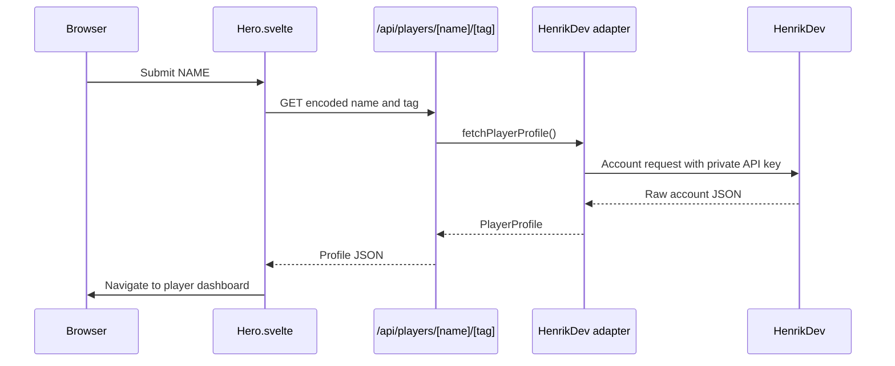
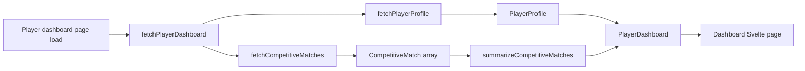

# Radiant Stats

Radiant Stats is a Valorant performance dashboard. A player enters a Riot ID in the form `NAME#TAG` and, when it resolves, is taken directly to a recent competitive-match summary and match log.

The project is deliberately small: one SvelteKit application, one external data provider, and application-owned types between the provider and UI.

## Quick Start

Requirements: Node.js 20+ and pnpm.

```bash
pnpm install
```

Create `.env.local` in the repository root:

```dotenv
VALORANT_API_KEY=your_henrikdev_api_key
```

`VALORANT_API_KEY` is read only by server code. Do not prefix it with `PUBLIC_`, commit it, or use it in a browser component.

```bash
pnpm dev
```

Vite normally starts at `http://localhost:5173`. Search for a Riot ID that HenrikDev can resolve, then select the profile result to open its dashboard.

## What Happens When You Search



The dashboard route follows the same pattern but calls the server-only adapter directly. It does not call this application's profile API over HTTP.



## Architecture

### Routes

| Route                       | Responsibility                                    |
| --------------------------- | ------------------------------------------------- |
| `/`                         | Search UI that opens a resolved player dashboard. |
| `/players/[name]/[tag]`     | Server-rendered competitive dashboard.            |
| `/api/players/[name]/[tag]` | JSON profile endpoint used by the search UI.      |
| `/api/health`               | Minimal health-check endpoint.                    |

### Important Modules

| Path                                              | Responsibility                                                                                                      |
| ------------------------------------------------- | ------------------------------------------------------------------------------------------------------------------- |
| `src/lib/components/Hero.svelte`                  | Parses `NAME#TAG`, owns browser loading/error state, and navigates successful searches to the dashboard.            |
| `src/lib/components/LoadingOverlay.svelte`        | Full-screen lookup and route-transition status UI.                                                                  |
| `src/lib/components/Nav.svelte`                   | Shared header and home link.                                                                                        |
| `src/lib/components/NavButtonGroup.svelte`        | Context-aware search and dashboard-section navigation.                                                              |
| `src/lib/player-profile.ts`                       | Stable, application-owned profile contract.                                                                         |
| `src/lib/player-dashboard.ts`                     | Stable match and summary contracts plus pure metric aggregation.                                                    |
| `src/lib/server/valorant/henrik-client.ts`        | HenrikDev boundary: validates input, calls the provider, validates provider data, and maps it to application types. |
| `src/routes/players/[name]/[tag]/+page.server.ts` | Loads the dashboard and maps known failures to HTTP errors.                                                         |
| `src/routes/players/[name]/[tag]/+page.svelte`    | Renders profile identity, metric cards, and recent competitive history.                                             |

### Server Boundary

Only code under `src/lib/server` imports `$env/dynamic/private`. This is the security boundary that keeps `VALORANT_API_KEY` out of the client bundle.

The app does not hand raw HenrikDev responses to the browser. `henrik-client.ts` parses `unknown` JSON and maps valid data into these contracts:

- `PlayerProfile`: Riot ID, region, account level, card images, and last-update text.
- `CompetitiveMatch`: one player’s outcome, map, agent, score, timestamp, and per-match statistics.
- `CompetitiveSummary`: aggregate win/loss record, K/D, KDA, ACS, ADR, headshot percentage, and most-played agent/map.
- `PlayerDashboard`: the profile, summary, and match list rendered by the dashboard.

This design makes a provider swap or upstream schema change local to the adapter instead of spreading provider fields through Svelte components.

### Metric Definitions

- **Win rate:** wins divided by all returned matches, including draws in the denominator.
- **K/D:** total kills divided by total deaths, with zero deaths guarded as one for display stability.
- **KDA:** total kills plus assists, divided by total deaths.
- **ACS and ADR:** per-match values are combined using round weighting, so a long match has proportionately more influence than a short match.
- **HS%:** total headshots divided by total recorded hit locations, not an average of match percentages.

The current provider request asks for the latest 20 competitive PC matches. Provider availability and match-history coverage vary by account.

## Navigation

The shared header always exposes **Search**. On a player dashboard it also exposes **Profile**, **Overview**, and **Match log** anchors. These targets live in the player page and make the fixed header useful on long pages without routing or refetching.

## Errors and Empty States

- Invalid name/tag values return HTTP `400`.
- A provider account `404` becomes a player-not-found response.
- Network problems, invalid upstream JSON, missing configuration, and unexpected provider shapes become HTTP `502`.
- A player with no competitive history receives a normal dashboard empty state rather than an error.

The browser search component shows a user-facing message for these failures. The player page uses SvelteKit's error page for failed loads.

## Tests and Validation

Tests are deterministic and use mocked `fetch` responses; they do not call HenrikDev.

| Test                                    | What it protects                                                                     |
| --------------------------------------- | ------------------------------------------------------------------------------------ |
| `tests/henrik-client.test.ts`           | URL encoding, authorization headers, profile parsing, and competitive-match mapping. |
| `tests/player-dashboard.test.ts`        | Weighted aggregate metric calculations and empty histories.                          |
| `tests/player-profile-endpoint.test.ts` | Profile endpoint success and error responses.                                        |
| `tests/health.test.ts`                  | Health endpoint response.                                                            |

Run the full validation sequence before sharing a change:

```bash
pnpm check
pnpm lint
pnpm format:check
pnpm test
pnpm build
```

## Project Map

```text
src/
  app.css                              Global theme and base styles
  lib/
    components/                        Reusable Svelte UI
    server/valorant/henrik-client.ts   Server-only HenrikDev adapter
    player-dashboard.ts                Dashboard domain types and calculations
    player-profile.ts                  Profile domain type
  routes/
    +page.svelte                       Search page
    api/                               JSON and health endpoints
    players/[name]/[tag]/              Dashboard load function and page
tests/                                 Vitest suites
static/images/                         Logo and agent artwork
docs/learning/radiant-stats.md         Learning ledger and review prompts
```

## Next Extensions

- Add caching and rate limiting before opening the app to public traffic.
- Add provider pagination or historical storage if the product needs more than the provider's current returned window.
- Derive agent and role performance from normalized matches; keep that calculation in `player-dashboard.ts` with fixture tests.
- Add round-event analytics such as attack/defense splits, opening duels, clutches, and economy conversion only after defining their exact data requirements.
